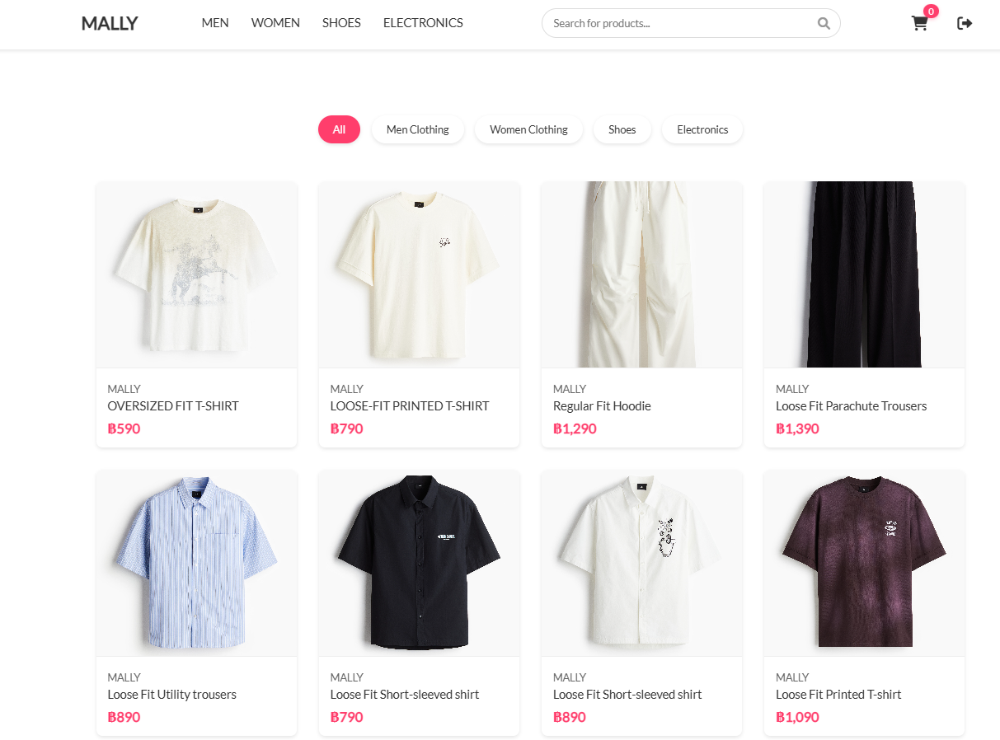
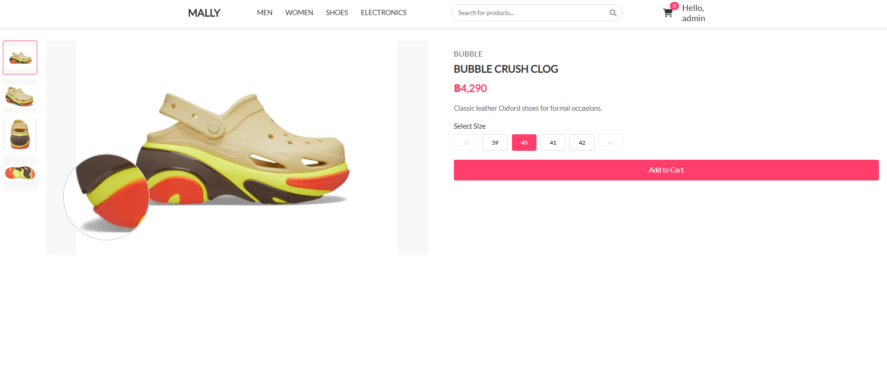
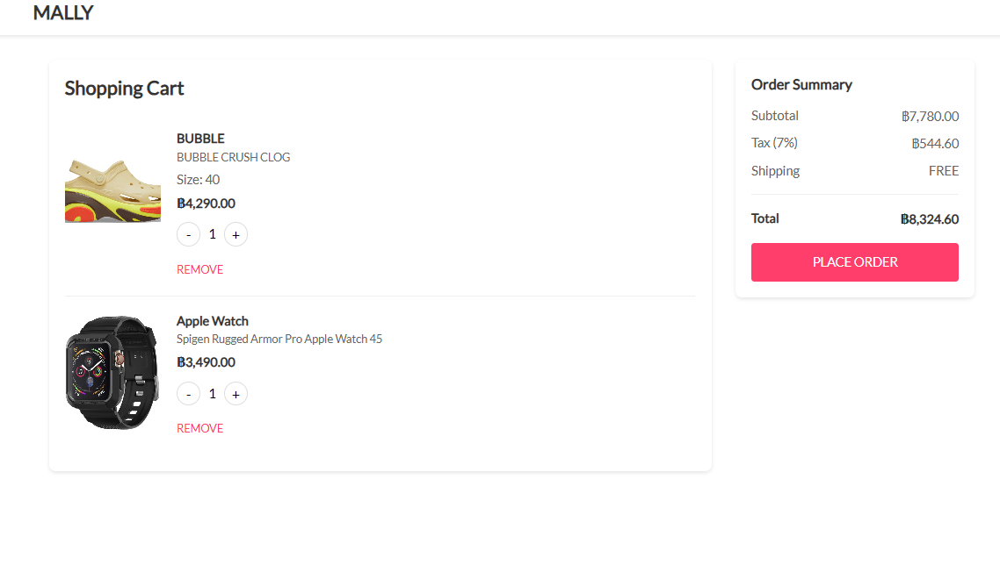
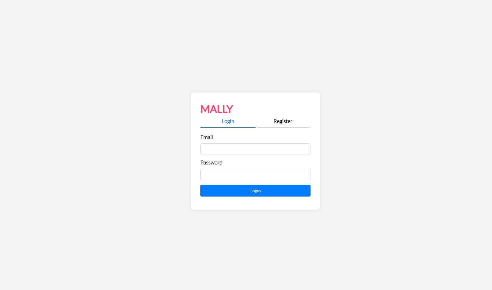

# MALLY E-commerce Website

A modern e-commerce website built with HTML, CSS, JavaScript, Node.js, Express, and SQLite. The website features a responsive design and implements core e-commerce functionalities.

## Features

### Core Features
1. **Product Catalog by Category**
   - Browse products by categories (Men, Women, Shoes, Electronics)
   - Search products by name, description, or brand
   - Responsive product grid layout

2. **Add Product to Cart**
   - Add products with size selection (for applicable items)
   - Real-time cart count update
   - Cart persistence across sessions

3. **Check-out Cart**
   - View cart items with quantities
   - Update quantities or remove items
   - Order summary with subtotal, tax, and shipping
   - Secure checkout process

### Optional Features
1. **User Authentication**
   - User registration and login
   - Session management
   - Protected routes for cart and checkout

2. **Admin Dashboard**
   - Product management (Add, Edit, Delete)
   - View orders and their status
   - Basic analytics

## Technologies Used

1. **Frontend**
   - HTML5
   - CSS3 (Responsive Design)
   - JavaScript (ES6+)
   - jQuery for DOM manipulation
   - Bootstrap for UI components

2. **Backend**
   - Node.js
   - Express.js
   - SQLite database
   - RESTful API architecture
   - MVC pattern

## Project Structure

```
project/
├── assets/
│   ├── css/
│   └── images/
├── src/
│   ├── config/
│   │   └── database.js
│   ├── controllers/
│   │   ├── auth.js
│   │   ├── cart.js
│   │   ├── order.js
│   │   └── product.js
│   ├── middleware/
│   │   └── auth.js
│   ├── models/
│   │   ├── user.js
│   │   ├── product.js
│   │   ├── cart.js
│   │   └── order.js
│   ├── public/
│   │   ├── js/
│   │   ├── index.html
│   │   ├── auth.html
│   │   ├── cart.html
│   │   ├── product-detail.html
│   │   └── orderPlaced.html
│   ├── routes/
│   │   ├── auth.js
│   │   ├── cart.js
│   │   ├── order.js
│   │   └── product.js
│   └── server.js
├── package.json
└── database.sqlite
```

## Setup Instructions

1. Clone the repository:
   ```bash
   git clone <repository-url>
   cd project-directory
   ```

2. Install dependencies:
   ```bash
   npm install
   ```

3. Create a .env file in the root directory with the following variables:
   ```
   PORT=3000
   JWT_SECRET=your-secret-key-change-this-in-production
   NODE_ENV=development
   ```

4. Set up the database:
   ```bash
   npm run setup-db
   ```

5. Start the server:
   ```bash
   npm start
   ```

   For development with auto-reload:
   ```bash
   npm run dev
   ```

6. Visit `http://localhost:3000` in your browser

## API Endpoints

### Products
- `GET /api/products` - Get all products
- `GET /api/products/:id` - Get product by ID
- `GET /api/products/category/:category` - Get products by category
- `POST /api/products` - Add new product (Admin only)
- `PUT /api/products/:id` - Update product (Admin only)
- `DELETE /api/products/:id` - Delete product (Admin only)

### Cart
- `GET /api/cart` - Get user's cart
- `POST /api/cart` - Add item to cart
- `PUT /api/cart/:id` - Update cart item
- `DELETE /api/cart/:id` - Remove item from cart

### Auth
- `POST /api/auth/register` - Register new user
- `POST /api/auth/login` - Login user
- `GET /api/auth/logout` - Logout user

### Orders
- `POST /api/orders` - Create new order
- `GET /api/orders` - Get user's orders
- `GET /api/orders/:id` - Get order details
- `PUT /api/orders/:id/status` - Update order status (Admin only)

## Screenshots

### Home Page (index.html)


### Product Detail Page (product-detail.html)


### Shopping Cart Page (cart.html)


### Login Page (auth.html)


## Environment Variables

The following environment variables are required:

- `PORT` - Port number for the server (default: 3000)
- `JWT_SECRET` - Secret key for JWT token generation
- `NODE_ENV` - Environment mode (development/production)

## Contributing

1. Fork the repository
2. Create your feature branch (`git checkout -b feature/AmazingFeature`)
3. Commit your changes (`git commit -m 'Add some AmazingFeature'`)
4. Push to the branch (`git push origin feature/AmazingFeature`)
5. Open a Pull Request

## License

This project is licensed under the MIT License - see the LICENSE file for details.

# E-CommerceWebsite
 A mobile responsive sample of E-Commerce Website using HTML, CSS, JavaScript and API's
 
 
 
### Home page
)


### Content Description page


### Ordered List page


### Order confirm page

